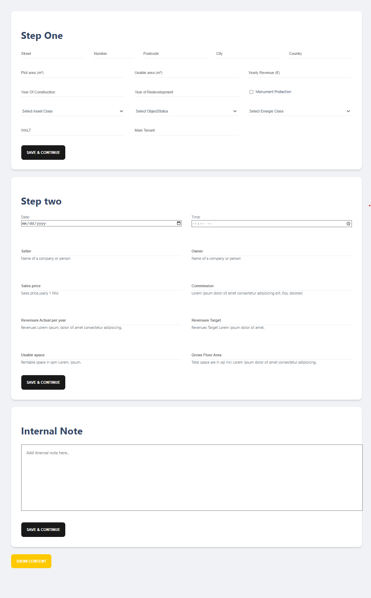

# Getting started

git clone https://github.com/assetbird/alex-coding-challenge.git

npm install

npm run dev

# How to use?

1. Fill in the three separate forms. For each of them, you can click on the black button to save the data in the form. None of the form fields are required. Once a form has been saved, a purple checkmark will indicate that the data has been stored.

2. To view the saved results, click on the yellow button below. It will open up a modal that shows all the data entered. Because the form is so complex, I added that empty fields are also shown.

